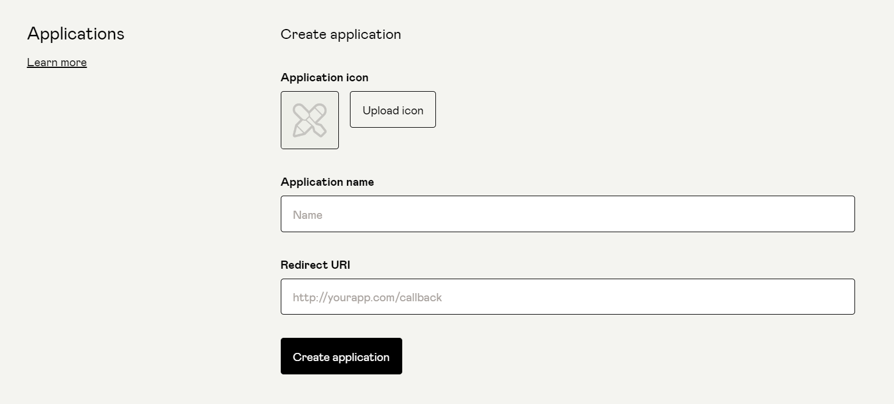
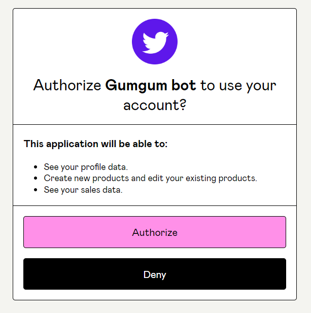

# Gumroad Auth with ReactJS

Gumroad Official API docs: https://app.gumroad.com/api

Go to your gumroad profile -> Advanced -> Applications -> Create Application



You will get Application ID and Application Secret here.

Change `.env.example` to `.env` and Add value in `.env` file.

```sh
npm i
npm run start
```

After you click on `Connect Gumroad` button.



In App.js file, you can add your scopes, I have like these `scope=view_profile+edit_products+view_sales`

P.S. It's just for demo, so you must store App Id and App secret in Backend, not in FrontEnd.
